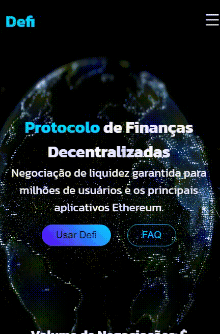
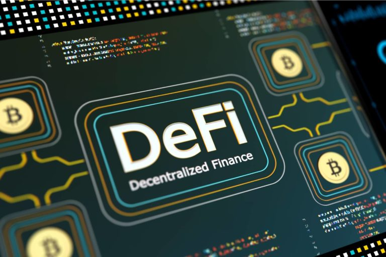

<h1 align="center">
   
  
    
</h1>

As finanças descentralizadas, também chamadas de DeFi, são consideradas por muitos o futuro do sistema financeiro. Elas funcionam por meio da tecnologia blockchain e permitem criar sistemas de pagamentos, realizar transações financeiras e contratar empréstimos sem a necessidade de intermediários.

A grande revolução está na quebra da necessidade de confiar em uma terceira parte, como bancos e governos. Em DeFi, tudo é realizado por códigos automáticos, conhecidos como ‘contratos inteligentes.

Os contratos inteligentes, ou smart contracts, são as linhas de código que permitem criar aplicações na blockchain. Esta, por sua vez, funciona como um grande computador descentralizado; vários validadores participam da rede e atestam a validade dos contratos inteligentes.

<i>"Seja bem-vindo"</i>

 

  <kbd>
    
  </kbd>
  &nbsp;&nbsp;&nbsp;&nbsp;
  <kbd> 
    
  </kbd>
  &nbsp;&nbsp;&nbsp;&nbsp;

  

## **`Tecnologias utilizadas`**
- JavaScript
- CSS
- ReactJS
  

<h1 align="center">
   
  
    
</h1>

Made with 💙 by Gustavo Mattos 👋 [See my LinkedIn](linkedin.com/in/guh-mattos/)

